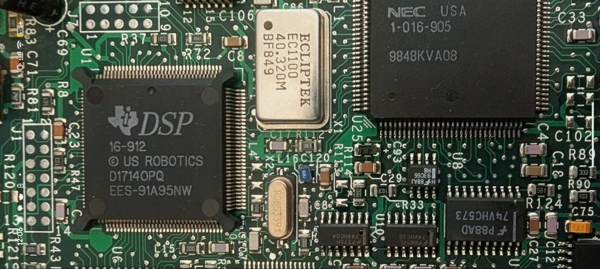
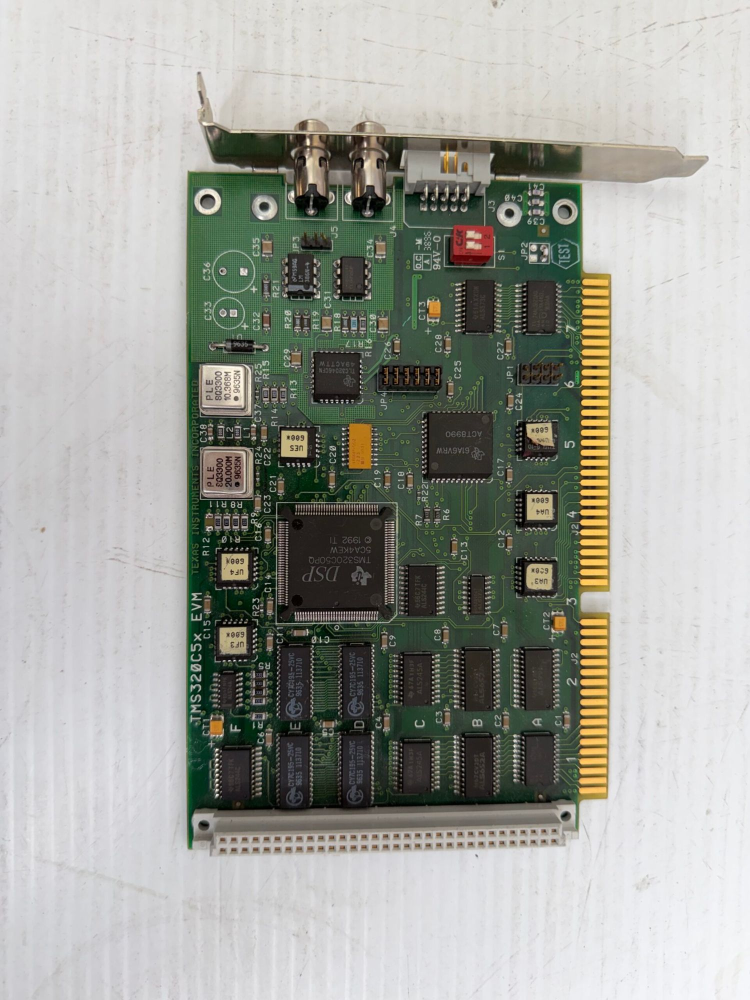

<p align="center">
  
</p>

# c5xtools

[](https://github.com/wgrzegorz/c5xtools/actions/workflows/ci.yml)
[](https://github.com/wgrzegorz/c5xtools/actions/workflows/build-scripts.yml)
[](LICENSE)
[](BUILDING.md)
[](https://github.com/wgrzegorz/c5xtools/releases)
[](https://github.com/wgrzegorz/c5xtools/releases)

<div align="center">
<pre>
        ___|    _  |               |       
    __| __ \ \  /   __|  _ \   _ \  |  __|   
   (      ) |`  \  |   (   | (   | |\__ \  
  \___|____/ _/\_\\__|\___/ \___/ _|____/  
======================================dSc==
</pre>
</div>

A modern, dependency-free toolchain for the Texas Instruments TMS320C5x family
of fixed-point DSPs: an assembler, a linker, a hex/ROM converter and a
disassembler, written from scratch in portable C99.

## The need

I run a bulletin board, and somewhere along the way I fell into the cult of the
modem. The relic at the center of it is a US Robotics Courier V.Everything, the
last great analog modem. I wanted it to keep working on the only lines I
actually have today, which are SIP/VoIP rather than copper.

That is where the trouble starts. A VoIP gateway re-samples and re-codes the
very signals an analog modem depends on, so the Courier that handshakes fine on
a real line stumbles over a softswitch. The fix does not live in a setting; it
lives in the modem's DSP firmware, in how the chip trains, equalizes and detects
tones. On this modem that DSP is a Texas Instruments part custom-made for US
Robotics, marked D1714OPQ, which after some reverse engineering turned out to be
TMS320C51 silicon with a custom mask ROM. To change its firmware I had to be
able to assemble, link and convert C5x code.

<p align="center">
  
</p>

The chip itself is not the obstacle. TI documented the TMS320C5x exhaustively,
and those manuals are still around (the two I lean on are listed under
[References](https://github.com/wgrzegorz/c5xtools/wiki/References)). The
obstacle is the tooling. The original TI code-generation tools for this
architecture are abandonware: hard to find, harder to license, and a genuine
ordeal to run on anything made this decade. In 2026 you can read everything
about how a C5x instruction is encoded and still have no working way to produce
one.

So I wrote my own, from the documented behavior and from careful cross-checking
against known-good output. That is `c5xtools`. It started as scaffolding for a
firmware project and turned into something worth releasing on its own: if you
own one of these old DSPs and want to build code for it today, you should not
have to re-live the toolchain hunt I did.

## What the TMS320C5x is

The TMS320C5x is a family of 16-bit fixed-point digital signal processors that
TI shipped in the early-to-mid 1990s. They did the real-time signal processing
inside a whole generation of modems, telephony equipment, disk drives and audio
gear - and inside arcade hardware, where a 'C5x sat beside the main CPU doing the
heavy 3D math: matrix transforms, vertex calculations and texture-coordinate
setup. Namco's System 22 and Super System 22 (Ridge Racer, Time Crisis, Alpine
Racer, Ace Driver) drove their 3D on a TMS320C52; Kaneko's Super Nova (Cyvern,
Gals Panic S) and some Playmark boards used a TMS320C51 for sound and game logic.
That reach is why the part is still worth emulating: MAME runs a TMS320C5x core
to bring those boards back to life.

Architecturally it is a Harvard-style core built around a 32-bit accumulator, a
16x16 hardware multiplier, eight auxiliary registers with their own
address-arithmetic unit, a hardware stack, and separate 64K-word program, data
and I/O spaces. It is the kind of chip that still runs - in equipment people
depend on, and in the arcade boards people emulate - which is exactly why being
able to rebuild its code still matters.

<p align="center">
  
</p>

## The toolchain

| Tool     | Role                                                        |
|----------|-------------------------------------------------------------|
| `c5xasm` | assembler: source to a TI COFF object (or a flat listing)   |
| `c5xlnk` | linker: COFF objects to an absolute or relocatable image    |
| `c5xhex` | converter: COFF to Intel-HEX / Motorola-S / TI-tagged / bin |
| `c5xdis` | disassembler: an image back to re-assemblable source        |

All four share one instruction table (`include/c5x_isa.h`) and one COFF module
(`lib/c5xcoff/`), so the assembler's encoder and the disassembler's decoder
cannot drift apart. The output contract (COFF layout, instruction encodings and
the hex record formats) matches the original TI tools; `c5xdis --trace` adds a
recursive-descent analysis mode (call graph, code/data separation, data-page
tracking and computed-jump resolution) whose output still re-assembles
byte-for-byte.

## Processor-family support

The TI toolchain in SPRU018D covered the whole first/second-generation
fixed-point line - 'C1x, 'C2x, 'C2xx, 'C5x - and c5xtools splits the same way.
The assembler and disassembler are instruction-set specific and target the
TMS320C5x ('C50); since the 'C5x set is upward compatible with the 'C2x/'C2xx,
that compatible subset assembles too, and the handful of forms that are invalid
on the 'C5x are rejected on purpose. The linker and hex converter are
format-level, not instruction aware: they work on the TMS320 COFF with target id
0x0092, which the 'C2x, 'C2xx and 'C5x share, so they handle objects from any of
those devices regardless of the CPU that produced them. Nothing here reaches the
'C3x/'C4x, 'C54x/'C55x or 'C62x/'C64x/'C67x - those are different instruction
sets and object formats.

Compatibility with other TMS320 families is unverified, for a plain reason: I
have no access to evaluation hardware or silicon for those other platforms and
DSP families, so for those reasons there was no way to test it. The scope above
is deliberate and honest, not a claim that nothing else could work - the
instruction tables, the decoder and the framework itself could all be extended,
and contributions in that direction are welcome. And a genuine request: if you
have a spare period evaluation kit gathering dust - a 'C5x EVM, a 'C2x/'C2xx
EVM, a 'C3x/'C4x or 'C54x/'C55x board, or anything similar - that you would part
with,
please get in touch (see Support and bug reports below). It would make verifying
and extending family support actually possible.

## Design and references

Beyond scratching my own itch, this was also an experiment: can a small
toolchain for an old DSP be rebuilt to current standards and still be reliable?
So I held it to modern engineering practice rather than period practice.

I chose C99 and the MIT license on purpose. ISO C99 plus the C standard library,
and nothing else, so the same sources build almost anywhere a C compiler exists
(Linux, macOS, Windows, and even 32-bit DOS). MIT so the project stays open,
trivial to reuse or vendor into other work, and easy to find.

The implementation follows the established literature rather than guesswork:

- the assembler's expression evaluation and multi-pass symbol resolution follow
  standard compiler-construction practice (A. V. Aho, M. S. Lam, R. Sethi and
  J. D. Ullman,
  [*Compilers: Principles, Techniques, and Tools*](https://en.wikipedia.org/wiki/Compilers:_Principles,_Techniques,_and_Tools),
  2nd ed., Addison-Wesley, 2006);
- the linker's section placement, relocation and symbol resolution follow
  J. R. Levine, [*Linkers and Loaders*](https://linker.iecc.com/),
  Morgan Kaufmann, 1999;
- the disassembler combines a linear sweep with a recursive-descent traversal,
  after B. Schwarz, S. Debray and G. Andrews,
  ["Disassembly of Executable Code Revisited"](https://doi.org/10.1109/WCRE.2002.1173063),
  9th Working Conference on Reverse Engineering (WCRE), IEEE, 2002.

The instruction encodings and the COFF and hex record formats are taken from the
original TI documentation, both free from TI and kept here under
[`docs/`](docs/) for offline use:
[*TMS320C5x User's Guide*, SPRU056D](https://www.ti.com/lit/ug/spru056d/spru056d.pdf)
and
[*TMS320C1x/C2x/C2xx/C5x Assembly Language Tools User's Guide*, SPRU018D](https://www.ti.com/lit/ug/spru018d/spru018d.pdf).
The full list of sources is in the wiki
[References](https://github.com/wgrzegorz/c5xtools/wiki/References).

## Building

```sh
make                       # build all four tools
make test                  # build, then run the offline test suite
make install PREFIX=/opt   # install binaries and manuals
make clean
```

A C99 compiler (clang or gcc) and `make` are the only requirements. The test
suite is pure POSIX shell (`awk`, `od`, `dd`, `cmp`, and `sha256sum`/`shasum`):
no python, no wine, no TI tools. Cross-compiling for static Linux, Windows
(32/64-bit) and 32-bit DOS is documented in
[BUILDING.md](BUILDING.md).

## Prebuilt binaries

Each tagged release ships prebuilt archives for Linux (x86-64 and arm64,
static), macOS (universal), Windows (32/64-bit) and 32-bit DOS, each with a
signed build-provenance attestation you can verify with `gh attestation verify`.
See the
[latest release](https://github.com/wgrzegorz/c5xtools/releases/latest).

## Documentation

- Installed manual pages: `man c5xasm`, `man c5xlnk`, `man c5xhex`, `man c5xdis`.
- Build and cross-compile guide: [BUILDING.md](BUILDING.md).
- The full reference lives in the
  [wiki](https://github.com/wgrzegorz/c5xtools/wiki): the TMS320C5x
  architecture, registers, addressing modes and a per-instruction reference for
  the whole instruction set, plus the assembler syntax, directives, macro
  language, linker command language and hex formats. Every page is cross-checked
  against the original TI manuals.

## Validation

`make test` runs entirely offline. Each tool's output is confronted with frozen
TI golden files captured once and committed (the per-tool and package goldens
live under `test/`), each directory carrying a `SHA256SUMS` manifest; `c5xdis`
additionally round-trips the whole corpus and the examples byte-for-byte. There
is no dependency on the original TI tools at build or test time.

## Support and bug reports

This is a one-person project, built in the margins of a modem obsession, so
treat it accordingly: it is offered as-is, with no warranty, and I fix things
when I can.

That said, I would genuinely like to hear from you:

- Found a bug, a wrong encoding, or a mismatch against the TI tools? Please open
  an [issue](https://github.com/wgrzegorz/c5xtools/issues) with the input that
  reproduces it (a short `.asm` or the object/image bytes). Byte-exactness is
  the whole point, so these reports are the most useful thing you can send.
- A fix or a new test case is welcome as a pull request; the offline suite must
  stay green on Linux and macOS.
- If c5xtools helped you bring an old DSP back to life, I would love to know
  where it ended up.

## License

Brought to you by + Cult of the Modem +

MIT - (c) 2026 Grzegorz Worona <grzegorz@worona.pl>. See [LICENSE](LICENSE).
