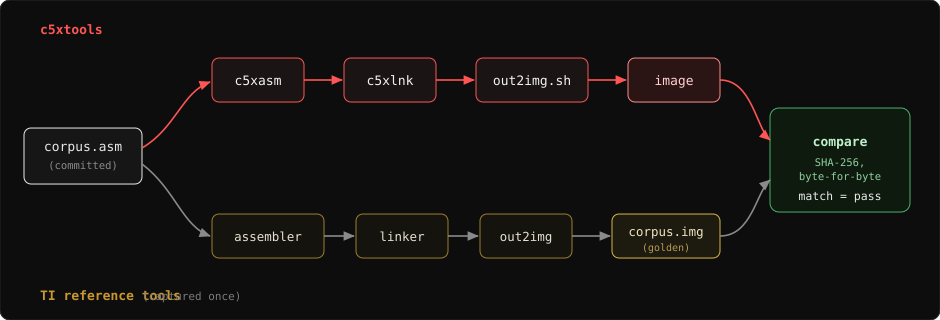

  

<pre>
        ___|    _  |               |       
    __| __ \ \  /   __|  _ \   _ \  |  __|   
   (      ) |`  \  |   (   | (   | |\__ \  
  \___|____/ _/\_\\__|\___/ \___/ _|____/  
======================================dSc==
</pre>

# c5xasm vs the reference assembler: ISA conformance gate

A systematic, repeatable check that c5xasm encodes every C5x mnemonic and a
broad matrix of operand forms exactly as TI's original reference assembler
(CGT 7.02, `-v50`) does. This exists so coverage gaps are found in bulk by a
regression gate, not one at a time when an example happens to hit them.

## Two axes

Axis A, per mnemonic: one representative, relocation-free form of every mnemonic
in `c5xasm/src/c5x_isa.h`, except the ones the reference assembler rejects on C5x
(below).

Axis B, operand forms: a matrix across the multi-form families: all addressing
modes (`dma`, `*`, `*+`, `*-`, `*0+`, `*0-`, `*BR0+`, `*BR0-`, with and without a
next-ARP suffix), short vs long immediates and the optimisation boundary around
them, shift fields, the `BMAR`-addressed `BLDD`/`BLPD` forms, and single- and
multi-condition `BCND`/`CC`/`RETC`/`XC`. This is the axis on which alternate-form
gaps hide (for example `BLDD BMAR,*+`, `BLPD BMAR,dma`).

Both axes are emitted, reloc-free, into one `corpus.asm` (committed alongside its
golden `corpus.img`).

## How it runs

  

`sh check.sh` is the wine-free gate: it builds `corpus.asm` with c5xtools and
compares the full 16-bit linked image to the committed golden `corpus.img`. It is
wired into `build.sh --test`. A mismatch is a real c5xasm / reference-assembler
divergence.

`sh capture.sh` is the one-time (re)capture of `corpus.img` from the reference
tools under wine. It is only needed after editing the corpus. The reference
assembler returns rc=0 even when it aborts, so the script detects success by the
output file, not the exit code.

## Forms the reference assembler (-v50) rejects, intentionally excluded from the corpus

| form                         | the reference assembler message                          |
|------------------------------|---------------------------------------|
| `FORT`, `RFSM`, `SFSM`, `RTXM`, `STXM` | `SERIAL PORT INSTRUCTIONS INVALID ON C5x/C2xx` |
| `CONF k`                     | `INVALID OPCODE FOR SELECTED VERSION` |
| `BLPD dma,...` (data-memory source) | `OPERAND MISSING` - source must be `#pma` or `BMAR` |
| `BCND a,LEQ,NEQ`, `XC n,TC,NTC` | `INVALID CONDITION VALUE` - two conditions from one group |

c5xasm rejects every one of these too (verified), so behaviour matches on both
the accept and the reject side.

## Result

As captured: 859 corpus words, c5xasm byte-for-byte identical to the reference
assembler, across all C5x mnemonics and the operand-form matrix.

## License

MIT - (c) 2026 Grzegorz Worona <grzegorz@worona.pl>. See `LICENSE`.
