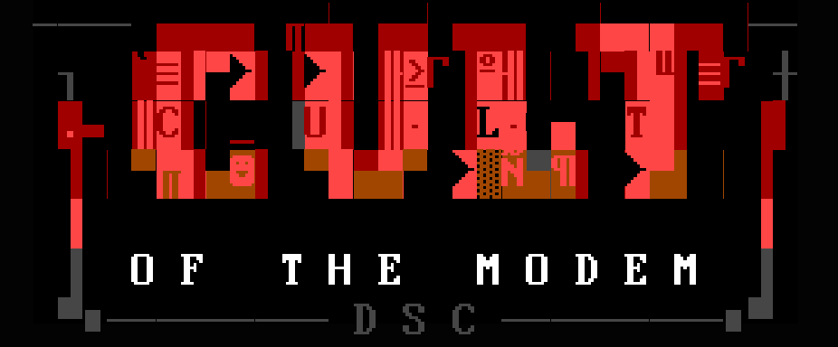

<p align="center">
  
</p>

<div align="center">
<pre>
        ___|    _  |               |       
    __| __ \ \  /   __|  _ \   _ \  |  __|   
   (      ) |`  \  |   (   | (   | |\__ \  
  \___|____/ _/\_\\__|\___/ \___/ _|____/  
======================================dSc==
</pre>
</div>

# c5xhex - TMS320C5x COFF->hex converter (improved the reference hex tool)

A dependency-free POSIX C99 converter that turns an executable TI COFF `.out`
(from `c5xlnk` or the reference linker) into a boot/ROM image. The modern replacement for TI's
`the reference hex tool.EXE`, part of the c5xtools chain (`c5xasm` -> `c5xlnk` -> `c5xhex`).

## Usage
```
c5xhex <in.out> -f intel|srec|tagged|ascii|bin [-o out] [-romwidth 8|16] [-order lsb|msb] [-e addr]
```

## Improvements over the reference hex tool

Full image by default (`-romwidth 16`): each 16-bit word emitted as two bytes,
so one run gives the complete ROM image. The reference hex tool defaults to an LSB-only byte file
and requires a second `-o msb` pass. `-romwidth 8 -order lsb|msb` reproduces the
reference hex tool split exactly.

One tool, five formats, modern `-h/--help` and `-V/--verbose`.

## Compatibility
`make test` is offline (no wine, no python): it confirms the Intel-HEX and
Motorola-S output is byte-identical to the real TI hex tool (frozen golden) in
compatibility mode, and that the full-16-bit binary round-trips to the linked
section words. TI-Tagged is emitted in a clean, valid form
(per-section, with a module header); its checksum uses the standard running-sum
convention rather than the reference hex tool's padded layout.

## License

MIT - Copyright (c) 2026 Grzegorz Worona <grzegorz@worona.pl>. See `LICENSE`.
